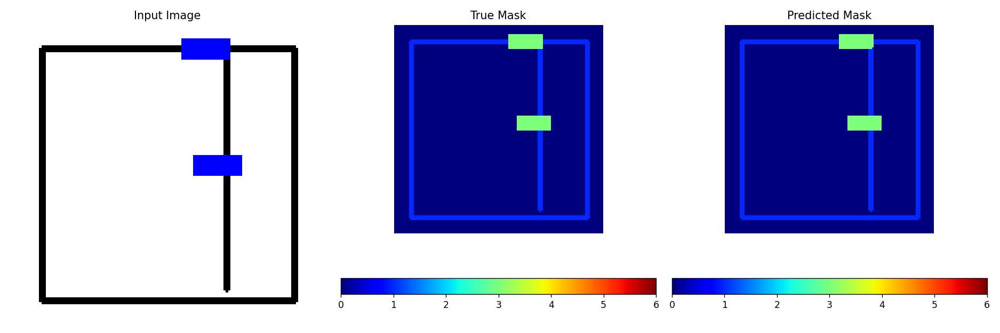

# 基于U-Net实现图像分割-户型图

# 数据集

通过脚本（`HW_CV/synthetic_dataset_generator.py`)随机生成的**500**张户型图（有大致的轮廓）。

除了基础的房间区域和背景外，还包含墙壁、门、窗、床、桌子和沙发等6个元素。
挑选一个样本，如下图所示，有内外墙、窗（绿色）、桌子（粉红色的圆形）、沙发（洋红色的长方形）：

# 训练

采用训练集大小：测试集大小= $4:1$的分割比例。

采用交叉熵损失函数，以及Adam作为优化器，以0.001的学习率为开始训练10代。

# 评估

|              | Loss     |
| ------------ | -------- |
| Training Set | $0.0026$ |
| Testing Set  | $0.0024$ |

挑选一个测试样本进行可视化以查看预测的效果，即展示一下**原图、标签图和预测结果**如下：

